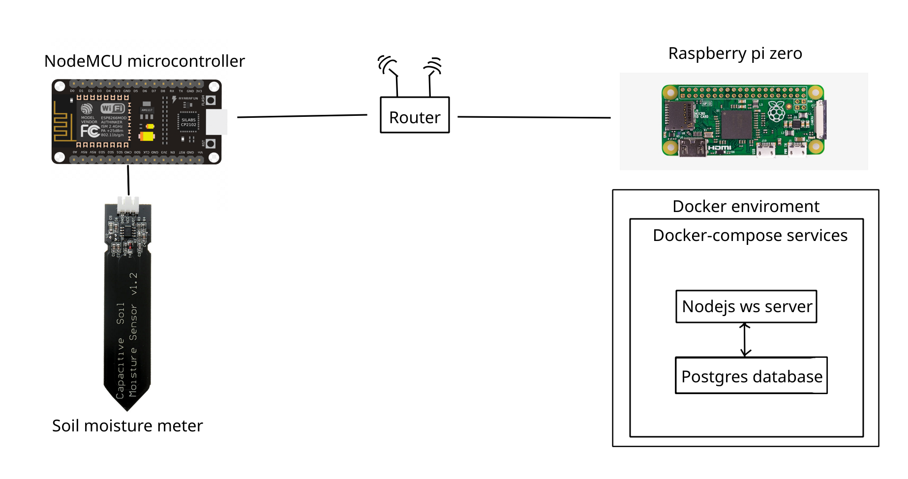

# nodejs-websocket-postgres-server
Websocket server using implemented in node js with postgres datbase used for my repo home-system as a temporary server

The goal of this project is to use raspbery pi zero and use it as a server for websockets. 
Data recieved from websockets will be then saved to postgresSQL database. 
The goal for now is to use system that measures my apartment plants so I can water them better. 
This server is used as a temporary solution because I will have the server on nvidia jetson nano, but I dont have it yet and I want to collect the data.

Rasperry pi zero has docker and docker compose installed on its system, 
im using prebuild arm32v6 docker images, because this is a x32 chip and its arm based but it's not hard to find docker images.

Received data is from NodeMCU, a microcontroller that reads analog values from soil moisture meter.
This project is a small part from my idea of "smart house".

Run PgAdmin4 with docker
docker run -p 8008:80 \
    -v $HOME/data/pga4volume:/var/lib/pgadmin \
    -e 'PGADMIN_DEFAULT_EMAIL=user@domain.com' \
    -e 'PGADMIN_DEFAULT_PASSWORD=SuperSecret' \
    -d dpage/pgadmin4
